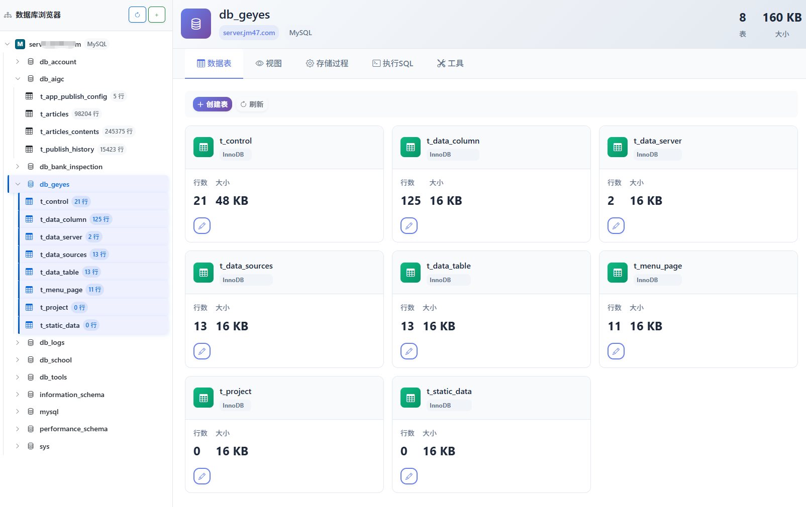

# fdb2 - Cross-Platform Database Management Tool

[中文](README_zh.md) | English

> 🚀 A lightweight, open-source database management tool supporting 8+ database types, providing a Navicat Premium-like professional experience — completely free and running locally!



## 🔥 Core Features

### 🌐 Multi-Database Support
- **8+ Database Types**: MySQL, PostgreSQL, SQLite, SQL Server, Oracle, CockroachDB, MongoDB, SAP HANA
- **Compatibility Extensions**: MariaDB/TiDB/Aurora compatible with MySQL, Aurora PostgreSQL compatible with PostgreSQL
- **NoSQL Support**: MongoDB document database

### 🎯 Professional Features
- **Connection Management**: Visual configuration, one-click testing, secure local storage
- **Structure Browsing**: Complete display of tables, indexes, foreign keys, views, stored procedures
- **Data Operations**: Full CRUD operations, conditional queries, pagination, batch import/export
- **SQL Editor**: Syntax highlighting, auto-completion, formatting, query history
- **Performance Monitoring**: Real-time connection status, query performance analysis, slow query detection

### ⚡ Key Advantages
- **Zero Configuration**: Ready to use immediately after global installation
- **Cross-Platform**: Full compatibility with Windows, macOS, and Linux
- **Lightweight & Efficient**: Minimal resource usage, fast startup
- **Local Storage**: All data stored locally, secure and reliable
- **Offline Usage**: Manage local and remote databases without internet
- **Fully Open Source**: MIT license, free to use and contribute

## 🚀 Quick Start

### 📥 Installation Options

#### 💻 Desktop Client (Recommended)
Download the pre-built cross-platform desktop application for immediate use:
- **[Windows / macOS / Linux Client Download](https://github.com/fefeding/fdb2/releases/tag/client)**
- Unzip and double-click to run, no environment setup required

#### 📦 Command Line Tool
Install globally via npm/yarn/pnpm:
```bash
# npm (recommended)
npm install -g fdb2

# yarn
yarn global add fdb2

# pnpm
pnpm add -g fdb2
```

### ▶️ Start Service

```bash
# Start the database management tool
fdb2 start

# Start with custom port
fdb2 start -p 8080

# Stop service
fdb2 stop

# Check service status
fdb2 status

# Restart service
fdb2 restart
```

### 🌐 Access Application

After successful startup, open in your browser (check startup logs for the actual port):
```
http://localhost:9800
```

> 💡 **Tip**: Default port is 9800, but if occupied, it will automatically select another available port

## 📊 Supported Database Types

| Database Type | Default Port | Key Features |
|--------------|-------------|-------------|
| **MySQL** | 3306 | Stored procedures, triggers, views, full-text search, partitioning |
| **PostgreSQL** | 5432 | Stored procedures, triggers, views, JSON/JSONB, window functions |
| **SQLite** | - | Lightweight file-based database, zero configuration, embedded |
| **SQL Server** | 1433 | T-SQL, stored procedures, CLR integration, AlwaysOn |
| **Oracle** | 1521 | PL/SQL, RAC, Data Guard, advanced security |
| **CockroachDB** | 26257 | Distributed SQL, strong consistency, automatic sharding |
| **MongoDB** | 27017 | NoSQL document database, aggregation pipeline, indexing |
| **SAP HANA** | 39013 | In-memory database, real-time analytics, column store |

### 🔄 Compatibility Notes
- **MariaDB/TiDB**: Compatible with MySQL protocol — select MySQL type
- **Amazon Aurora MySQL**: Compatible with MySQL — select MySQL type
- **Amazon Aurora PostgreSQL**: Compatible with PostgreSQL — select PostgreSQL type
- **Better-SQLite3**: Compatible with SQLite — select SQLite type

## 🤝 Contribution Guide

Contributions are welcome! Code contributions, bug reports, or feature suggestions are all appreciated.

### Development Environment Setup
```bash
# Clone repository
git clone https://github.com/fefeding/fdb2.git
cd fdb2

# Install dependencies
pnpm install

# Start development server
pnpm dev

# Build production version
pnpm build
```

### Contribution Workflow
1. Fork the project
2. Create a feature branch (`git checkout -b feature/your-feature`)
3. Commit changes (`git commit -am 'Add some feature'`)
4. Push to branch (`git push origin feature/your-feature`)
5. Create Pull Request

## 📄 License

This project is licensed under the [MIT License](LICENSE) — fully open source and free to use.

## 🙏 Acknowledgments

Thanks to all contributors and users for their support! Special thanks to the following tech stack:
- Vue 3 + TypeScript
- Vite build tool
- Bootstrap 5 UI framework
- vue-i18n internationalization
- Pinia state management

---

**Enjoy using fdb2 Database Management Tool! For any issues, please report at [GitHub Issues](https://github.com/fefeding/fdb2/issues).**

<!-- Chinese version available at [README_zh.md](README_zh.md) -->
